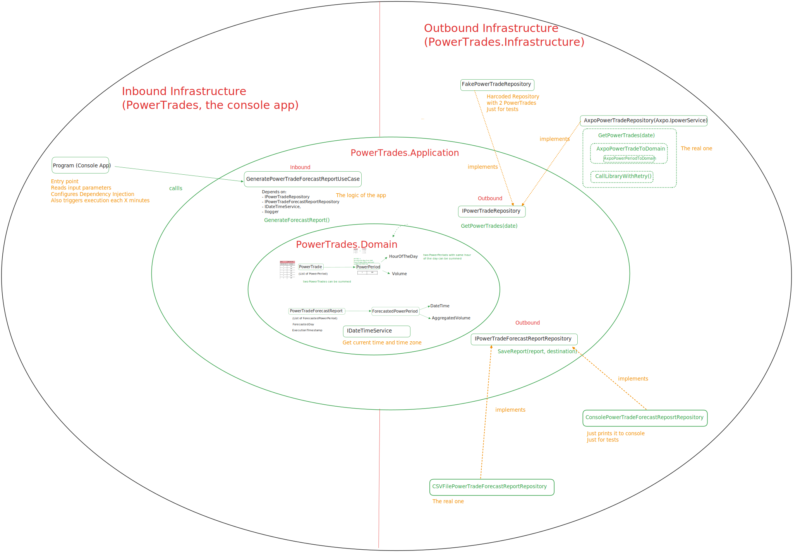
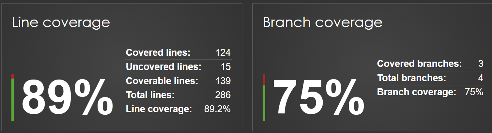

# power-trades

## How to launch the application

- .NET 8.0 required. 
- Compile the application. From the root folder, execute

```
dotnet build
```

- Run it:

```
.\PowerTrades\bin\debug\net8.0\PowerTrades.exe  --executionIntervalInMinutes=1 --destinationFolder=.\PowerTrades\bin\debug\net8.0
````

- CSV Files and logs will appear inside folder `.\PowerTrades\bin\debug\net8.0`.

## Architecture

Hexagonal architecture followed:

- **Domain**: Several domain concepts:
	- **PowerTrade**.
	- **PowerPeriod**. 
	- **PowerTradeForecastReport**: the day report with its **ForecastedPowerPeriods**.
	- **IDateTimeService**: to manage current date time, zone, etc. A real and a fake implementation for tests. 
- **Inbound**:
	- **Port**: `GeneratePowerTradeForecastReportUseCase`. **Adapter**: The console application program (`Program.cs`)
- **Outbound**: 
	-  **Port**: `IPowerTradeRepository` to get the power trades. Two **adapters**: a fake one for tests and the real one calling the Axpo library.
	-  **Port**: `IPowerTradeForecastReportRepository`, to "save" the generated report. Two  **adapters**: a fake one for test (printing in console) and the real one writing the CSV file.
		



## Test

- XUnit as test runner.
- FluentAssertions used for assertion. 
- NSubstitute used for mocking
- Code coverage: 



# Links

- Logs:
	- https://learn.microsoft.com/en-us/dotnet/core/extensions/logging
	- https://stackoverflow.com/a/75830211
- Dependency Injection: https://learn.microsoft.com/en-us/dotnet/core/extensions/dependency-injection-usage
- Reading Command Line Arguments: https://www.pietschsoft.com/post/2024/04/23/csharp-console-accept-commandline-arguments